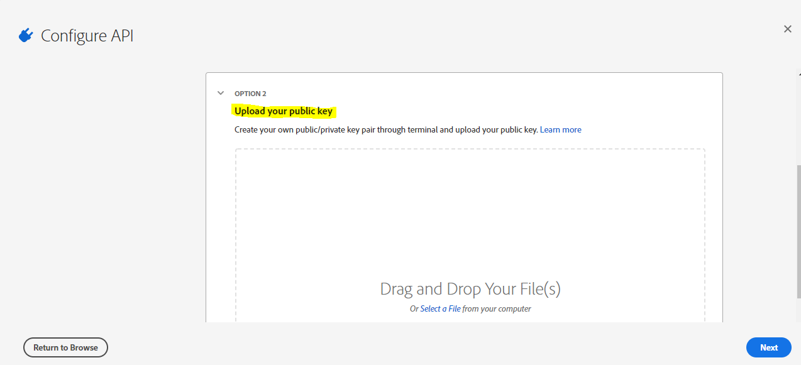

# Adobe Experience Platform (AEP) OAuth 2.0 Connection in webMethods.io

## Summary:

This article describes the step-by-step process of generating an Access token and configuring an account for the **Adobe Experience Platform** OAuth V2.0 Connection in webMethods.io 

## Pre-requisites:
- User needs to have a working **Adobe Experience Platform** account to log into the Adobe cloud console
- Applicable on the API
- Access permission for **Adobe Experience Platform** APIs
- Working **webMethods.io** tenant
- Create Java Keystore Certificate(.jks) and export Public key certificate on your local machine or platform server machine

## Contents:

- How to generate an Access token for the **Adobe Experience Platform** APIs required for the OAuth 2.0 Authorization 
- Establishing a Connection in **webMethods.io Integration** tenant

## Configure API and generate an access token:

1.	Login to **console.adobe.io**

2.	Go to Projects tab, Create a new **Project**

3.	Click **Add API**
	
	 
	
4.	Select **Experience Platform API**
	
	 
	
5.	Configure API, Upload your public key certificate, and click **Next**
	
	 
	
6.	Click **Next** to create a new **Service Account(JWT)**
	
	 
	
7.	Select all the product profiles as applicable and Click **Save configured API**

	 

8.	Click **Service Account (JWT)** and open Credentials details 
	Copy the following parameters required for account configuration in wM.io 
	*CLIENT ID* 
    *CLIENT SECRET* 
    *TECHNICAL ACCOUNT ID* 
    *ORGANIZATION ID*
 
	 
	
## Create a Connection for Adobe Experience Platform in webMethods.io

1.	Login to **webMethods.io Integration** tenant
	
2.	Create a **FlowService**

	 
	
3.	Enter **Adobe Experience Platform** and select the **Connector**

	 
	
4.	Select **Pre-defined Action** or **Add Custom Action** and Configure **Account**
	
	 
	
5.	**Add Keystore Certificate** 
	Provide the location of the Keystore file(.jks) and enter the password used while generating **.jks**

	 
	
6.	Select the JWT Keystore alias added and also select the JWT key alias used while creating Keystore(default “1”) 
	Generate Audience using ClientId, 
	Syntax : https://ims-na1.adobelogin.com/c/ClientId 
	Example : https://ims-na1.adobelogin.com/c/94ff378d74c84dc29ea9ee6a6bd43140 
	Sandbox Name : prod

	 
	
7.	Enter the following properties and leave the other properties with default values or else enter the values as per  		  	  requirements while configuring the account, 
		*Organization ID* 
		*Technical Account ID* 
		*JWT Keystore* 
		*JWT Key Alias* 
		*Audience* 
		*Client ID* 
		*Client Secret* 
		*Sandbox Name*

8.	In case the user needs to use this account for the Streaming APIs, then user needs to add the SNI details as mentioned in 	  the below snapshot
	
	 

9.	The User needs to create a different account in case of the Streaming Ingestation APIs. Adobe enables the SNI Support for 	  the Streaming APIs

10.	Select the created AEP account and continue to create the required custom action
	
	 

11.	Once the action and the account are selected, execute the FlowService to verify the connection to **Adobe Experience 		Platform**
	
	 

	 

