 
# Configuring Aha OAuth account in webMethods.io Integration Workflow  

## Summary:
   
This article describes about how to configure an OAuth App in Aha and configuring an account in webMethods.io workflow  

## Pre-requisites:
•	User must have a working Aha instance  
•	Working webMethods.io tenant   

## Contents:

Section 1: Register OAuth application in Aha   
Section 2: Generate an access token   
Section 3: Configuring an OAuth Aha account in webMethods.io   

### Section 1. Register OAuth application in Aha   

 1. Login to your Aha instance  

 2. Navigate to settings in the top right corner and select Developer in the left side  

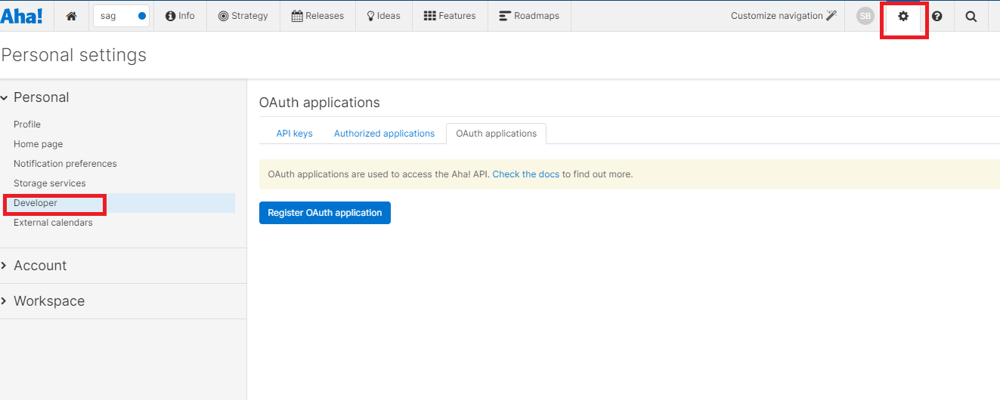 

 3. Click on Register OAuth application and provide the Name of the App and Redirect URI and click create  

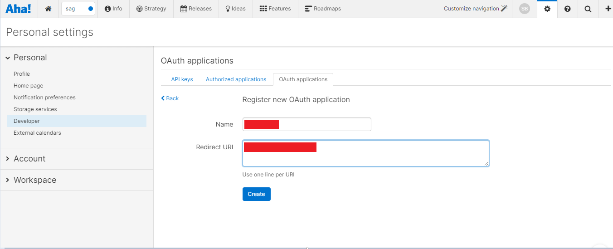 

 4. After creating the App - Redirect URI , Client ID , Client Secret , Authorize URL will be generated  

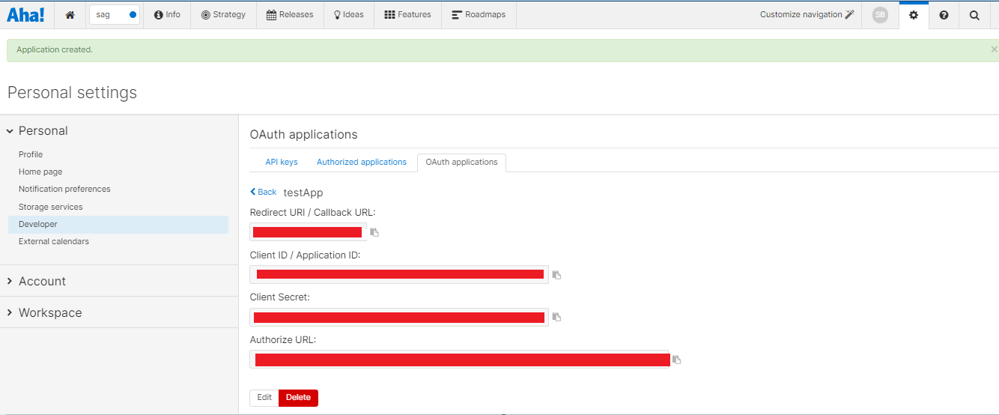 

### Section 2. Generate an access token   

 5.Copy Authorize URL and Paste the URL in Google and hit enter  

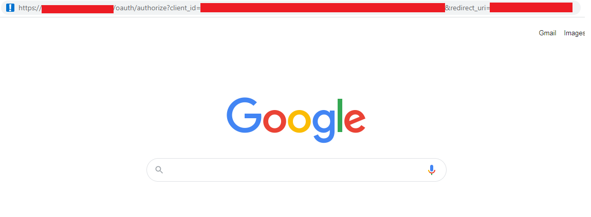 

 6.	Post Enter ,It will ask you to authorize the app  
 
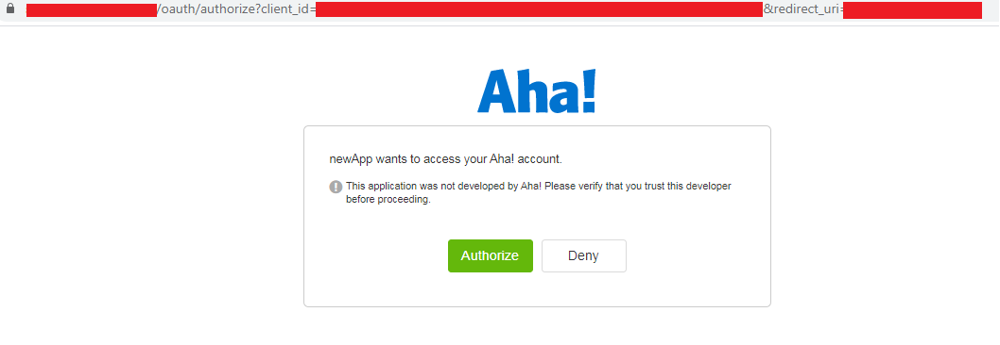 

 7.	After authorizing the app , Access Token will be generated  

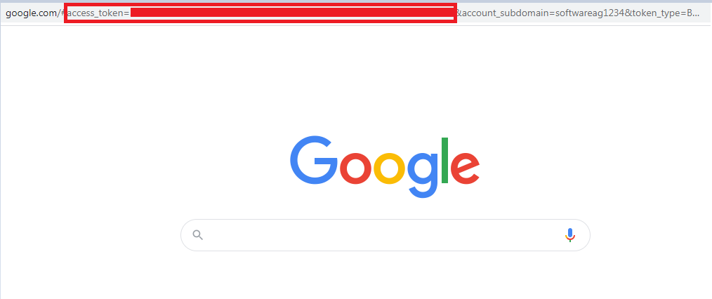 

Section 3: Setting up a Aha account in webMethods.io Integration tenant

 8.	Login to webMethods.io Integration tenant  
 9.	Create new project or choose an existing project if required  
 10.Click on workflows tab and add new workflow  

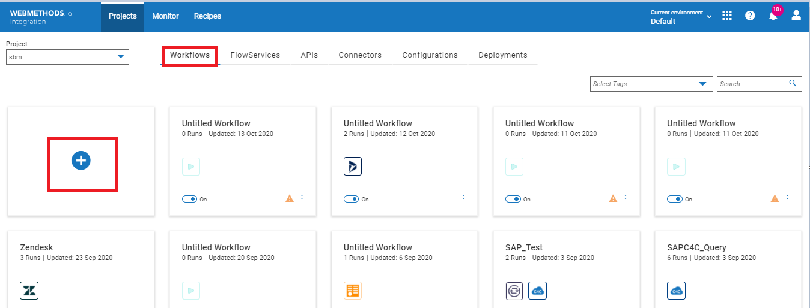 
 
 11. Name your workflow and then Drag and drop Aha from the connector pallet and double click on Aha connector to configure the account.  

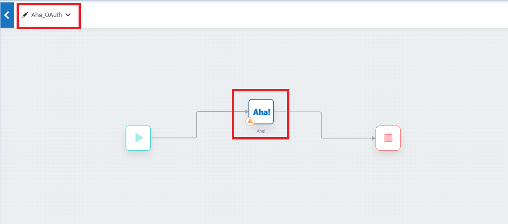 

 12. Select action  and click on (+) to add account  

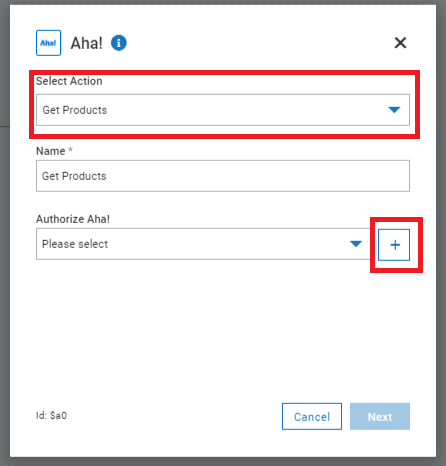 
 
 13.Enter all the required details and Click on “Add” to save the Account successfully.  

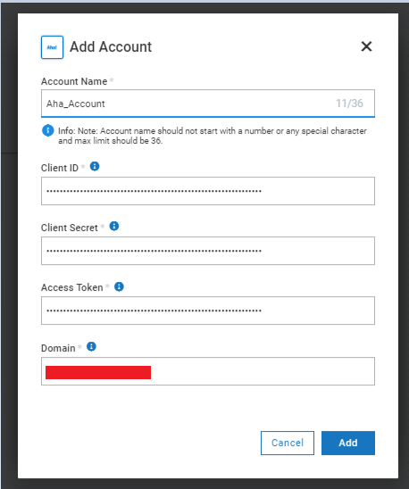 

 14.Connect the connector to stop and save the workflow and click on run to run the entire workflow  

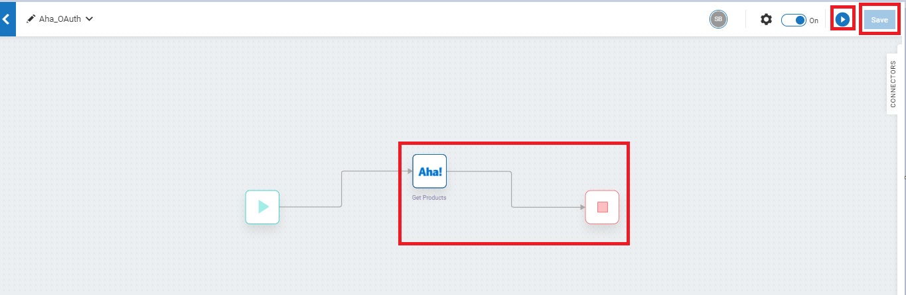 
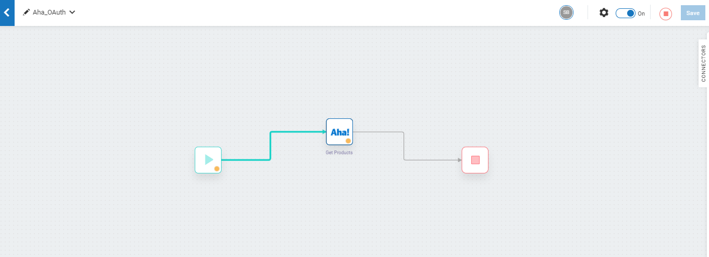 

