# Configuring Google OAuth account in webMethods.io Integration Workflow  

## Summary:

This article describes configuring an OAuth account to **Google Pub/Sub** in **webMethods.io Workflow** 

## Pre-requisites:
•	User needs to have a **Google** account  
•	Working **webMethods.io Integration** tenant  

## Contents:

Section 1: [Configure a **Google** OAuth](./Configure a **Google** OAuth)   
Section 2: Setting up a **Google** OAuth account in **webMethods.io Integration** tenant  

### Section 1. Configure a Google OAuth  

1.  Login to [Google Console](https://console.cloud.google.com) with the username and password 

2.  From the projects list, select a project from the dropdown or create a new one if required 

 

3. To use **Google Cloud API**, user must enable an **Google Cloud Pub/Sub API** for a project using console  

    i. On the left, click on **Navigation Menu** 
         
     

    ii. Under **APIs & Services** choose **Library**, select the API and **enable** it. 

    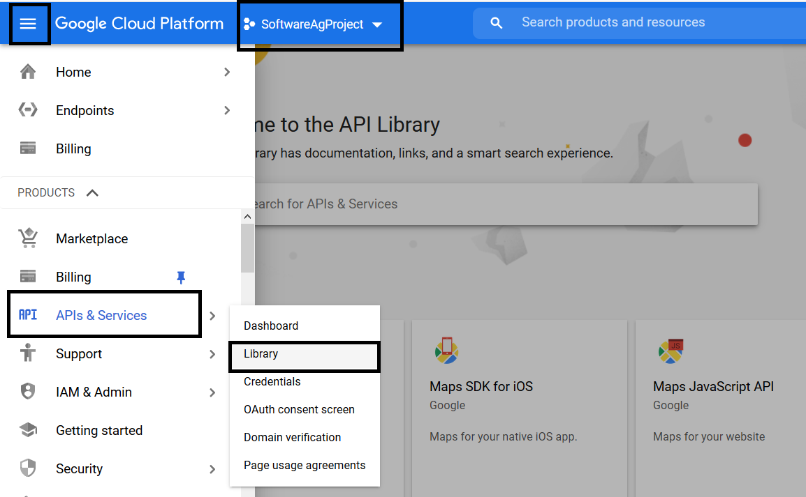 

    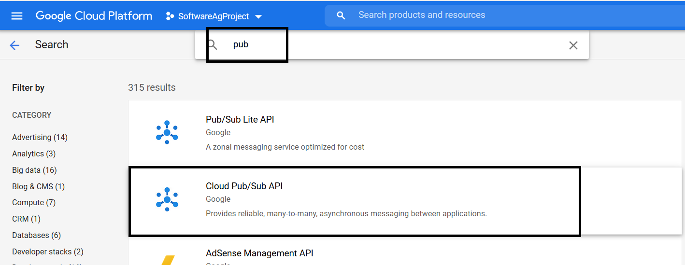 

    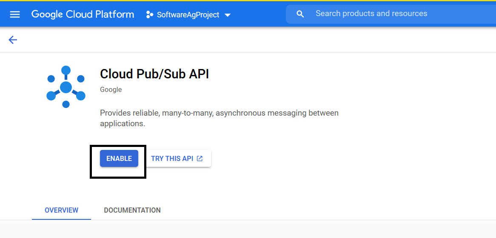 

4.  If the APIs & services page isn't already open, open the console left side menu and select **APIs & Services** 

5.  On the left, click **Credentials** 

6.  Click **+ Create Credentials**, then select **OAuth client ID** 

 

7. Users setting up **Google Cloud Console** for the first time, they need to configure the **Consent Screen** to get the **Client ID** click **Configure Consent Screen**.

 

8. In the next screen choose the user type as **External** click **Create**.

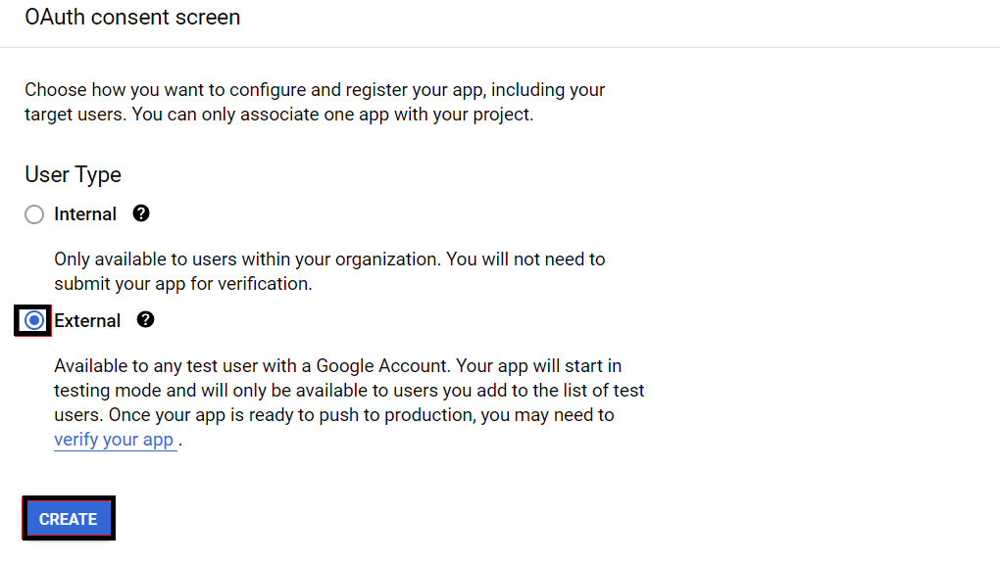 

9. Next screen will show for **Edit app registration**, provide the **App name** & **User support email**.

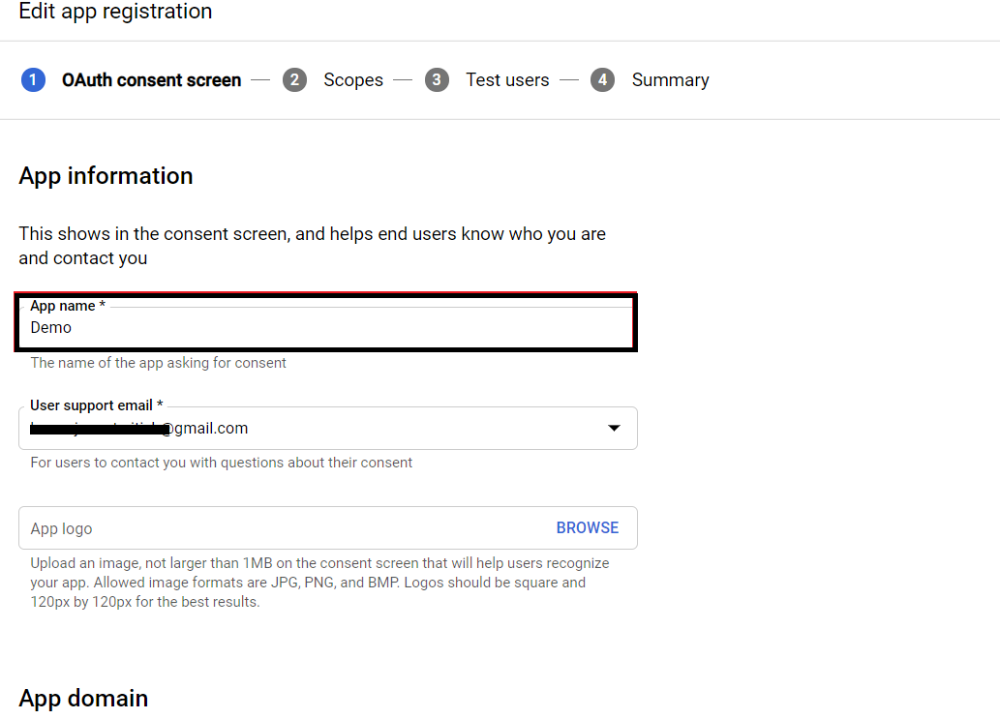 

10. Provide the details for **Application home page** & **Authorized domains**.

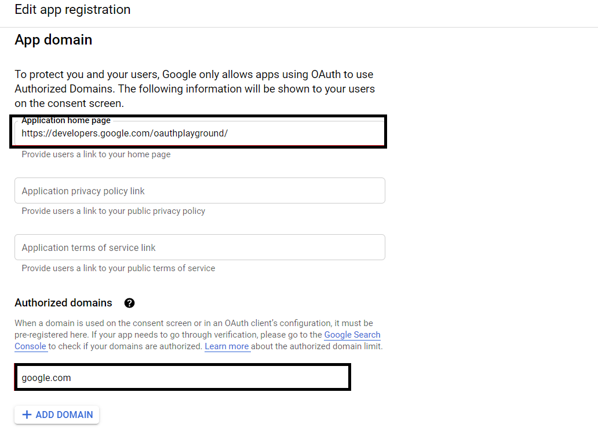 

11. Provide the details for **Developer contact information** & click **Save and continue**.

 

12. Next screen will show for configuring the **Scopes**, click on **Add or remove scopes** then select the ** API Check box** & click **Update**.

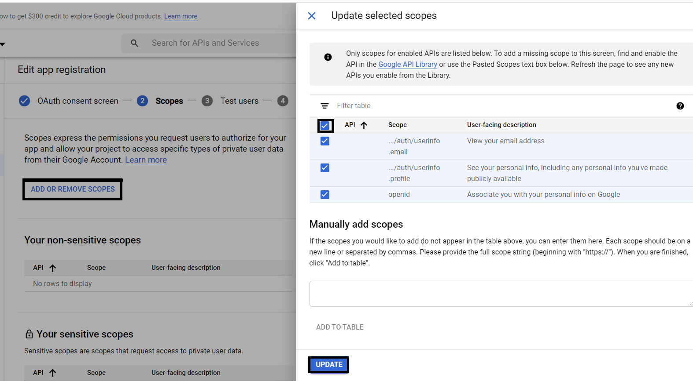 

13. Click **Add Users** to add some extra users for the app & click **Save & Continue**.

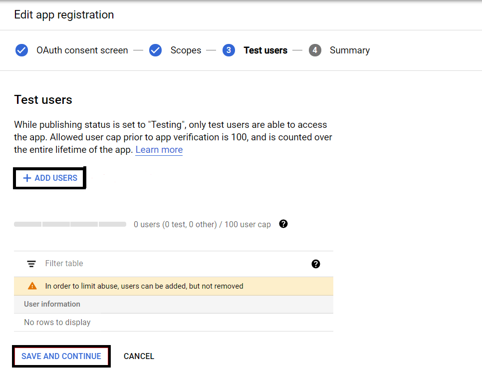  

14. Review the **Summery** section, then click **Back to Dashboard**. Now we have successfully configured the **Consent Screen**.

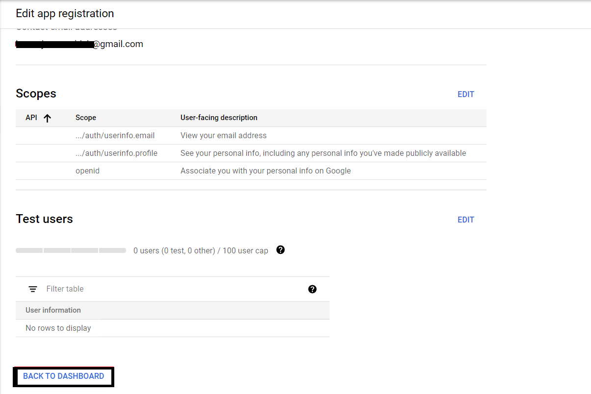 

15. Click **+Create Credentials** again & Select the appropriate application type (In this case application type is **web application**) for your project and enter any
    additional information required 

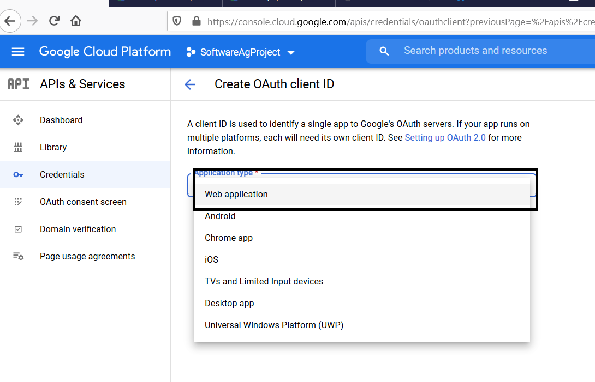 

16. Select **Authorized redirect URI's** and add the redirect URI as https://developers.google.com/oauthplayground and hit
    **Create** 

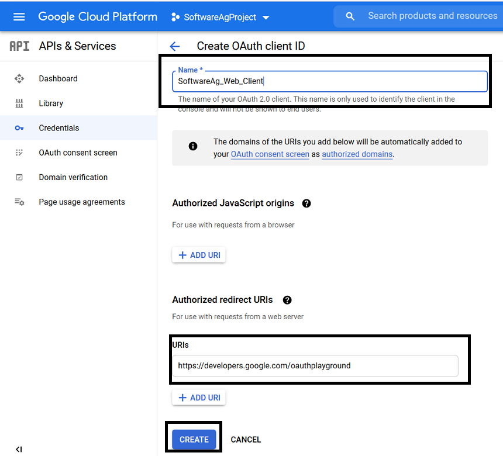 

17. Note down the **Client Id** and **Client Secret** created 

18. Open the browser and point the browser to [Google Oauth Playground](https://developers.google.com/oauthplayground) 

19. On the right corner of the page, click on gear icon and fill in OAuth Client ID and OAuth Client Secret generated
    (from Step 8) and click on Close 

 

20. On left side panel, select the scopes required 

 

21. Hit on **Authorize APIs** 

 

22. Click on **Exchange authorization code for tokens** 

 

23. Note down **Access Token** and **Refresh Token** 

 

### Section 2: Setting up Google OAuth account in webMethods.io Integration Workflow 

24. Login to **webMethods.io Integration** tenant and choose your project or click on **"+"** to create new project 

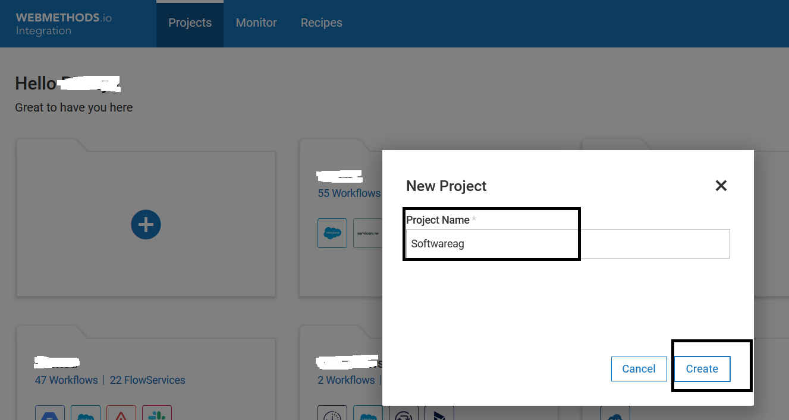 

25. Choose your workflow or click on **"+"** to create new workflow 

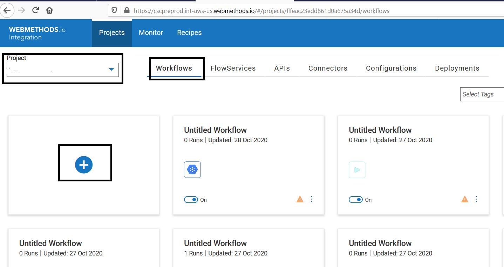 

26. From the right-hand panel of connectors list. Drag and drop a **Google Cloud PubSub Connector** 

 

27. Click on gear icon on the connector and choose any predefined operation (Example: listTopics) and click on **"+"** to 
    add account 

 

28. Fill in the **Client Id**, **Client Secret** obtained from Step 8 and **Access Token**,**Refresh Token**  obtained from Step 14 

    Refresh URL:  https://www.googleapis.com/oauth2/v4/token  
    Grant_type :  refresh_token  

 

29. Click on **Add** and Hit **Next** and pass the required inputs (In this case “listTopics” requires projectId to be passed) 

30. Click on **Save** and **Run** the workflow 

 

 
      

  
