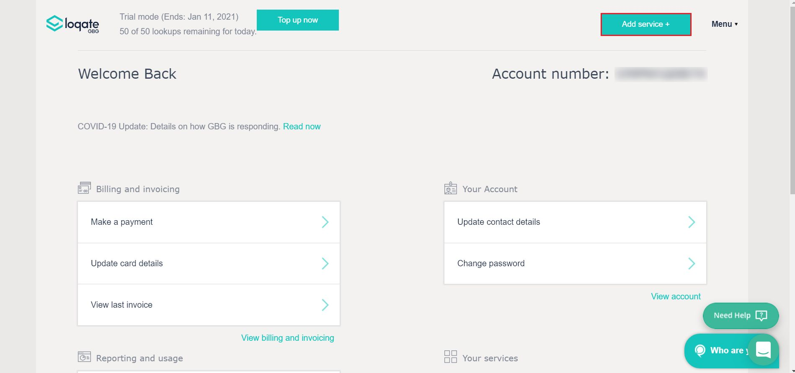
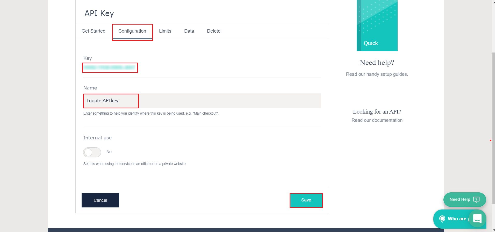
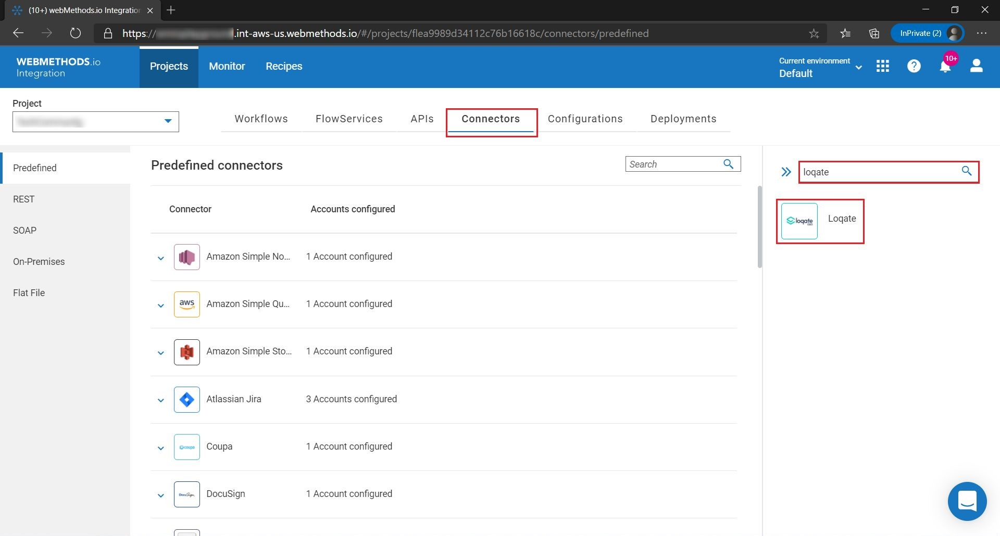
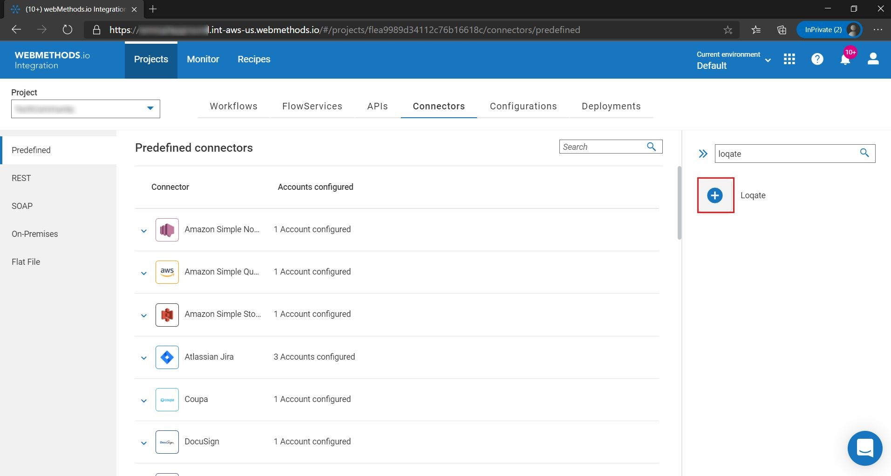
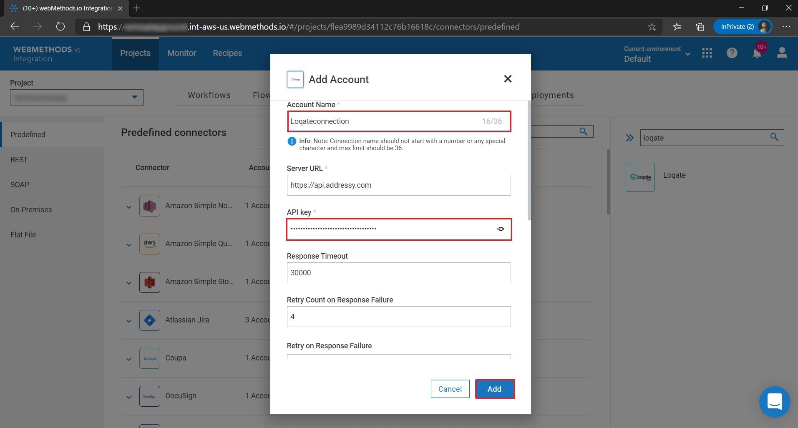

# Configuring Loqate account in webMethods.io Integration Workflow  

## Summary:

This article describes configuring an account to **Loqate** in **webMethods.io Workflow** 

## Pre-requisites:
•	Active **Loqate** account  
•	Active **webMethods.io Integration** tenant  

## Contents:

Section 1: Configure a **Loqate** account  
Section 2: Setting up a **Loqate** account in **webMethods.io Integration** tenant  

### Section 1. Configure a Loqate account  

1.  [Sign up](https://account.loqate.com/register/) to Loqate or [login](https://account.loqate.com/Login/?r=%2faccount%2f) if you already have an account. 

2.  Click on **Add service**,  In the Setup page , click on the API key 

	 

	 

3.  Switch to configuration tab and configure your Loqate API key  

     

4. Note down **API key**  

### Section 2: Setting up Loqate account in webMethods.io Integration Workflow 

5. Login to **webMethods.io Integration** tenant and choose your project or click on **"+"** to create new project 

6. Switch to **Connectors** tab 

7. Search for **Loqate** connector in the available connectors list.  

	 

8. Mouse hover on the **Loqate** connector icon and then click on the **"+"** icon. 

	 

9. Fill in the **Account name**, **API key** obtained from Step 4 . Click on **Add**. 

	 

10. An account for Loqate connector has been added successfully, now you can use this account in your Workflows/Flowservices 
