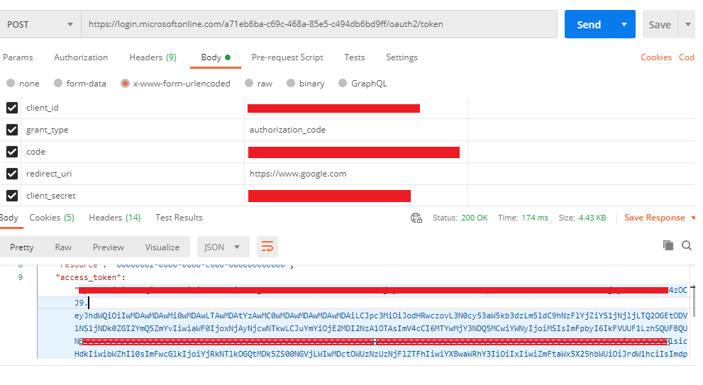
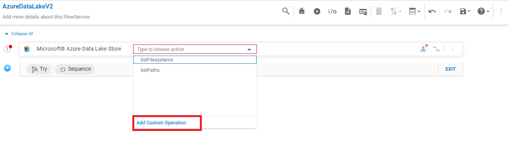

 
# Configuring Microsoft Azure Data Lake Store account in webMethods.io Integration Workflow  

## Summary:
   
This article describes the step-by-step process of registering **Microsoft Azure Data Lake Store Gen 2** with Azure Active Directory & generating the Access token, configuring the account in **webMethods.io Integration**.  

## Pre-requisites:
•	The user needs to have a working **Microsoft Azure Active Directory** and a **Microsoft Azure Data Lake License** to access the **API**.  
•	Working **webMethods.io Integration** cloud tenant.   

## Contents:

Section 1: Create and Configure the App in **Microsoft Azure Active Directory**   
Section 2: Generate the **Access_token** and **Refresh_token** using the REST Client   
Section 3: Configuring the **Microsoft Azure Data Lake Store Gen 2** account in **webMethods.io Integration**  

### Section 1. Create and Configure the App in **Microsoft Azure Active Directory**

 1. Login to the [Azure Portal](https://portal.azure.com/) (use your **Microsoft credentials**)  

 2. Once you have logged in navigate to **“Azure Active Directory”** and click on **“App registrations"**.  

 

 3. Click on **“New registration”**.   

 

 4. Fill in the necessary information for the App, like **Name** , **Redirect URI**  
Supported account types – Users can choose from the options based on their requirement. For more information about the supported scopes, click on “Help me choose...”  and click on **Register**  

In the URL field, enter the URL using which you need to obtain the OAuth authentication token in response to the request from the URL: (https://www.softwareag.com/en_corporate.html). Users can use any accessible URL like http://www.google.com  

 

 5. It will take a few seconds to create the application for you. Please note down the **Application ID** as you will require it when connecting to **Azure Data Lake Store using OAuth**.  

 

 6.	Click on **API permissions**, it will show the available permissions. Users can add more permissions based on requirement by clicking on **“Add a permission”** button.  
 
 

 7.	Select the **“Microsoft Azure Data Lake” API** from the API listing menu and click on it.  
**NOTE:** In case the user wants to use Microsoft Paid offerings, the user needs to obtain a license to use the desired APIs for the tenant.  

 

 8. Select all available permissions in the wizard, Delegated as well as Application permission and then click on **“Add permissions“** button.   
 
 

 9. After selecting all the necessary permissions, the user needs to click on the **“Grant admin consent”** button. Click on **“Yes”** to grant **admin consent**. 
 
 

### Section 2. Generate the **Access_token** and **Refresh_token** using the REST Client  
 
10. Users can also generate the **“client_secret”** via the below-mentioned process.  
-	Click on **Certificates and Secrets** and then click on **New Client Secret**.  
-	Choose the desired time duration for your secret key, click on the **Add** button.  
-	Your Client secret will be generated. Store it for use during Access Token generation.  

 

 
 
 11. Now we have done all the necessary settings, that we require to generate the Access_token. We will use the **“Postman” client** to generate the **Access_token**. Set up a POST call request with the base URL as below.  
https://login.microsoftonline.com/(tenant id)/oauth2/token  

 12. Generate **authorization code** using the below URL by providing the required data  
     https://login.microsoftonline.com/(tenant id)/oauth2/authorize?response_type=code&prompt=login&redirect_uri=(redirect uri)&client_id=(client id)  

 
 
 13. After generating authorization code , Add all the parameters mentioned below to generate access token in postman  
•	**Client ID:** Enter the Application ID from the registered app in Azure Portal.  
•	**Code:** authorization_code  
•	**Client Secret:** Enter the Client Secret generated   
•	**Code:** Enter the authorization code generated from step 12  
•	**Redirect_uri:** Enter the Redirect URL from the registered app in Azure Portal.  

 14.Now, we have generated the **Access_token** and **Refresh_token** successfully. We will configure the Microsoft connection in **webMethods.io Integration**.  

 
 

### Section 3. Configuring the **Microsoft Azure Data Lake Store Gen 2** account in **webMethods.io Integration**  
 
 15. Login to **webMethods.io Integration** tenant  
 16. Create new project or choose an existing project if required  
 17. Click on FlowServices tab and add new Flow Service  
 
 

 18. Name the flow service and choose the **Microsoft Data Lake Store V2 connector**.  
 
 
 
 19. Click on **“Add custom operation”** and then the “+” icon in the following tab. Users can choose the **predefined operations** and then Configure the **account** if required.  
 
 
 

 20. Enter all the **required** details and Click on **“Add”** to save the Account successfully.  
 
 
 

 21. After configuring the account , **“Name”** the custom operation , Select the functional area and click on **“Next”**  
 
 
 
 22. Select the **operation** and click on **“Next”**  
 
 

 23. Select the **Business Object**(Since the selected operation is of type **simple**, Business object not required here) and click on **“Next”**  
 
 
 
 24. Select the **Fields** (Since the selected operation is of type **simple**, Fields not required here) and click **“Next”**, Click on **“Done”** for the confirmation.  
 
 
 

 25. After creating custom operation and adding account , Save the flow service and click on run to run the flow service  
 
 

