# Register Dynamics CRM App with Azure for OAuth 2.0 Authentication  

## Summary  

  This article describes the step-by-step process of registering Microsoft Dynamics CRM application with Azure Active Directory and generating the    Access token and configuring the account in webMethods.io Integration.  

## Prerequisites  

The user needs to have a working Microsoft Azure Active Directory and a Microsoft Dynamics CRM License to access the API.  
Working webMethods.io Integration cloud tenant.

## Contents  

1. Create and Configure the App in Microsoft Azure Active Directory.  
2. Generate the Access_token and Resfresh_token using the REST Client.  
3. Configuring the Microsoft Dynamics CRM ACcount in webMethods.io Integration.  

## Steps  

  1. Login to [Azure Portal](https://portal.azure.com/) (Use the same credentials as your dynamics CRM, if it asks you to sign up and set up a trial, you can do that)
   
  2. Once you have logged in, navigate to the option “Azure Active Directory” and click on “**App registration**”.  

         

  3. Click on “New application registration”  
   
         

  4. Add the Necessary information for the App, Like:- “Name”,” redirect URL” and click on Register.  
    
     Supported Account types:- User can choose from the options, based on the needs. For more information about the supported scopes click on “Help me choose…”  

     In the URL field enter the URL using which you need to obtain the OAuth authentication token in response to the request from the URL (In my case I am going to use URL: https://www.softwareag.com/corporate/default.html). User can use any accessible URL for ex: http://www.google.com or any other.  

       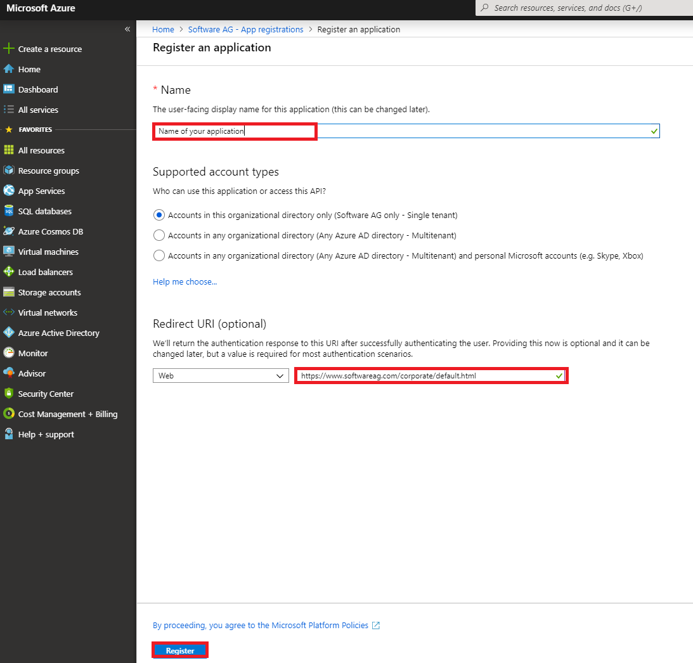  

  5. It will take a few seconds and create the application for you. Please note down the Application ID, you will need it when connecting to dynamics CRM using OAuth.  

       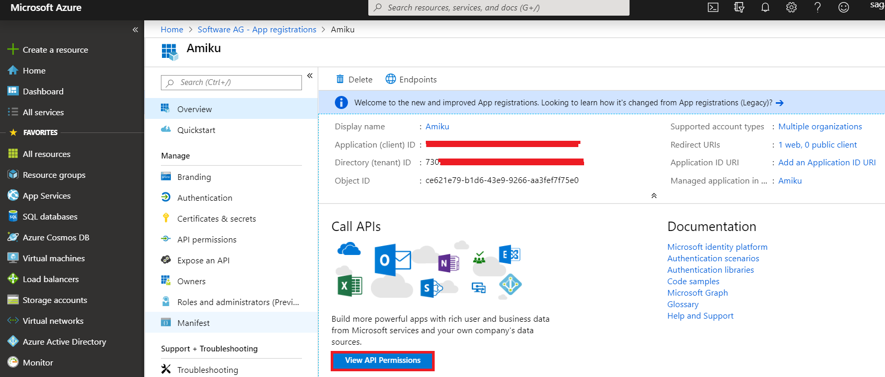  

  6. Click on the View API Permission, it will show all the available permission. User can add more required permissions via clicking on “Add a permission” button.  

       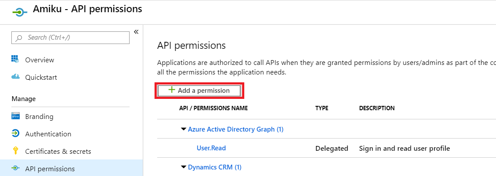  

  7. Select the API “Dynamics CRM” from the API Listing menu and click on that.  

      **Note:** In case user want to use Microsoft "PAID" offerings, then first he needs to get the Licence and then only his desired Microsoft API's will appear in his Microsoft Tenant.  

       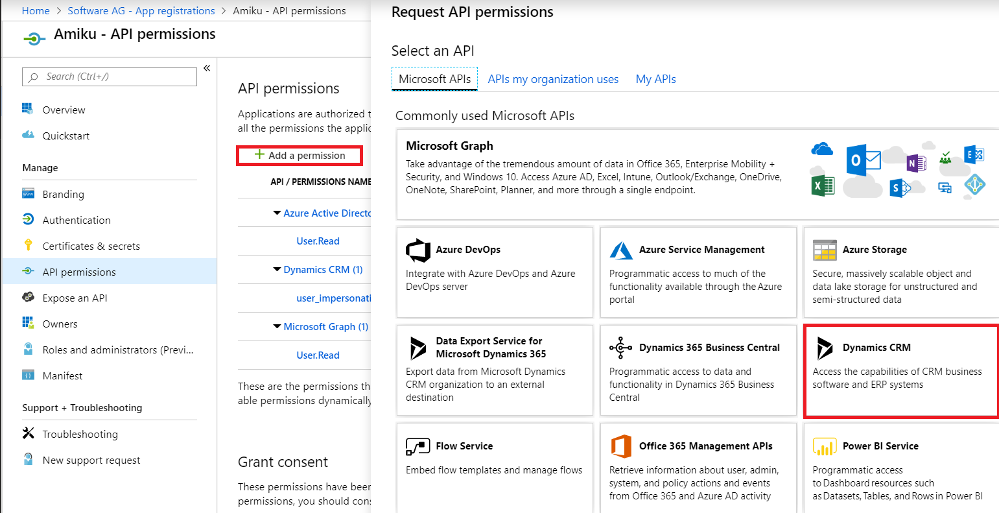  

  8. Select all the available permission in the wizard, Delegated as well as Application permissions (if available) and click on “Add permission” button.  

       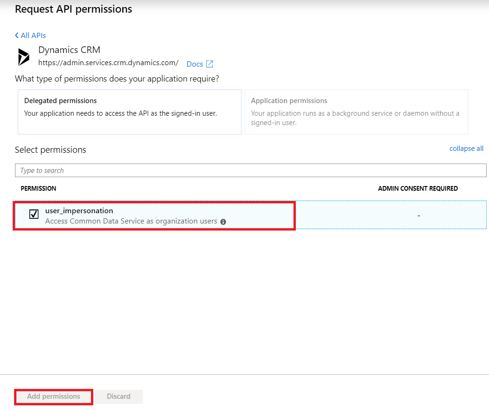  

  9. After selecting all the necessary permissions, the user needs to click on the “Grant admin consent” button.  

         

     Users can also generate the “client_secret” via the below-mentioned process.  

         

  10. Now We have done all the necessary settings, that we required to generate the Access_token. Now to generate the Access_token we will use "Postman" client. We need to authorize our app. For that, you need to send the request call on the browser with the below URL. once, you hit this URL in the browser, you will get the code.  

         https://login.microsoftonline.com/[TenantID]/oauth2/authorize?response_type=code&prompt=login&redirect_uri=<App redirect uri>&client_id=<App client id>  

  11. After getting the code, we need to generate the access token. Open the Postman client and follow the below steps.  

        POST https://login.microsoftonline.com/{TenantID}/oauth2/token  

        Header  

        Content-Type: application/x-www-form-urlencoaded  

        Body:  

        client_id: Your Application ID  

        grant_type: authorization_code  

        code: [the value obtained in Above steps]  

        redirect_uri:  [Your AAD App uri] (In my case: https://www.softwareag.com/corporate/default.html)  

        resource: that you want permission. [in case of Dynamics 365: https://<organisation<organisation>>.crm.dynamics.com]  

        client_secret: your app key will act as a secret.  

       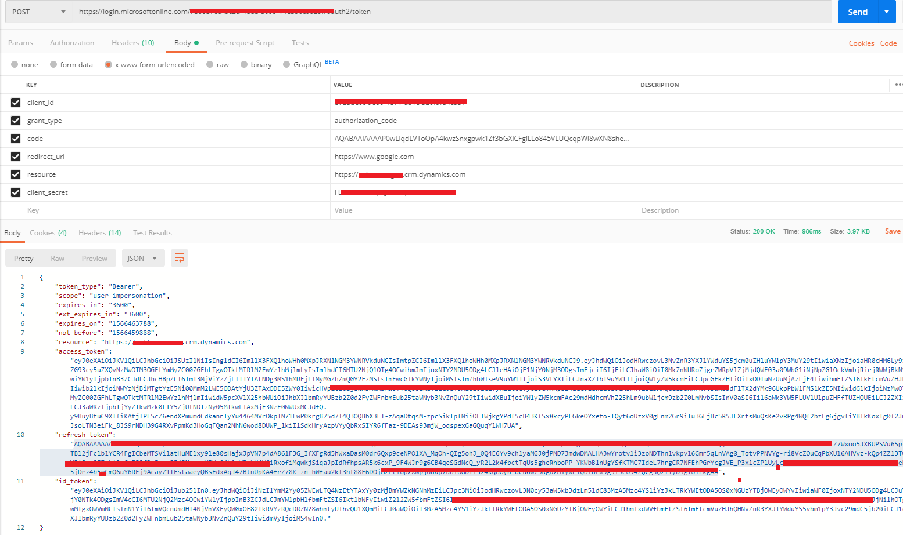  

  12. Now, we have generated the Access_token and Refresh_token successfully. We will configure the Microsoft connection in webMethods.io Integration. User needs to log in via his webMethods.io credentials and choose the "Microsoft Dynamics 365 CRM".  

       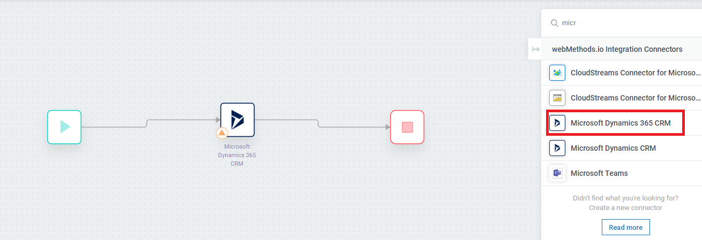  

  13. Click on the Setting button.  

       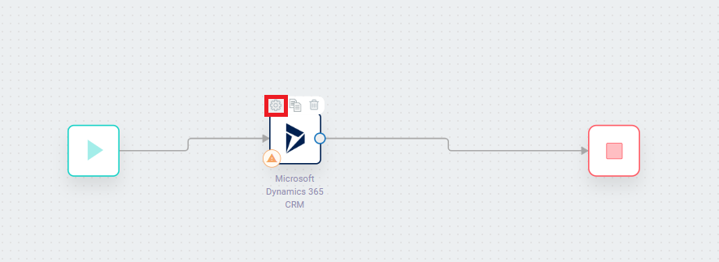  

  14. Now, click on the '+' icon to configure the connection.  

       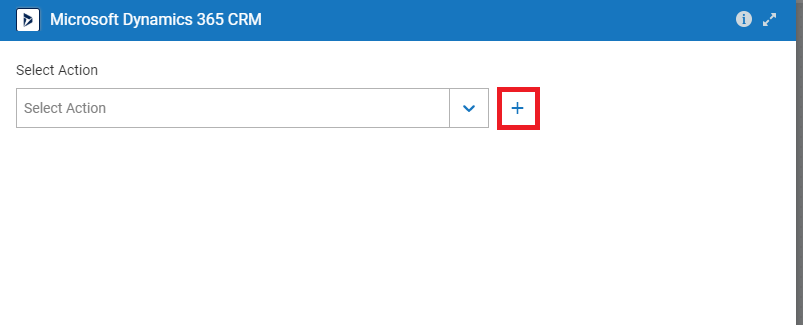  

  15. Now again click on the '+' icon and choose the "or" option in order to manually enter the credentials.  

         

  16. Now User Need to fill all the Details to save the connection successfully.  

       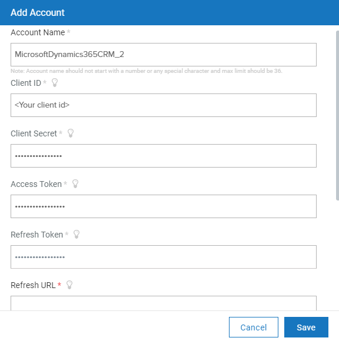  
       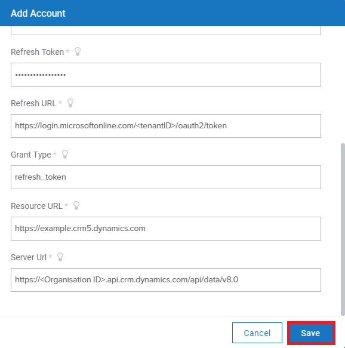  
