 
# Setting up Salesforce OAuth account in webMethods.io Integration Workflow  

# Summary:
   
This article describes how to configure an OAuth account to Salesforce using webMethods.io Integration Workflow  

# Prerequisites:
•	User must have working tenant of SaaS application, in this case Salesforce  
•	Working webMethods.io Integration tenant  

# Contents:

Section 1: Configure a SaaS application in Salesforce   
Section 2: Set up a Salesforce account in webMethods.io Integration tenant  

### Section 1. Configure a SaaS application in Salesforce 
**Steps** 

 1. Login to [Salesforce.com](https://login.salesforce.com)  
 2. Click on account setup page and hit **switch to classic** and hit **setup** 

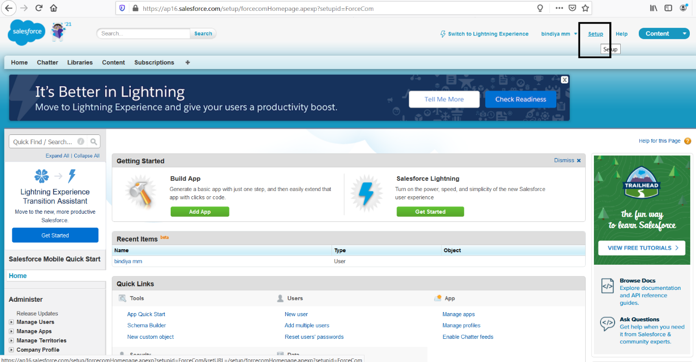 

 3. Search for **apps** in quick find box 

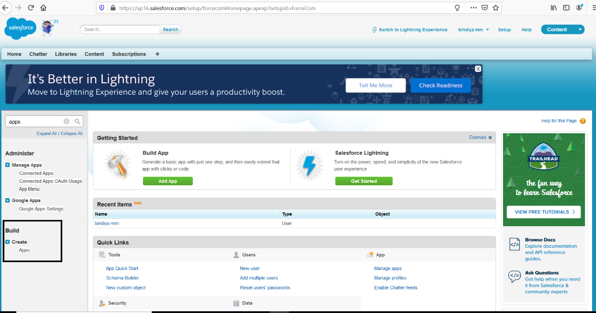 

 4. Add new connected app, name the app and fill in all necessary details like app name, email, callback url and add all scopes 
 5. Check in **Enable OAuth Settings** option 

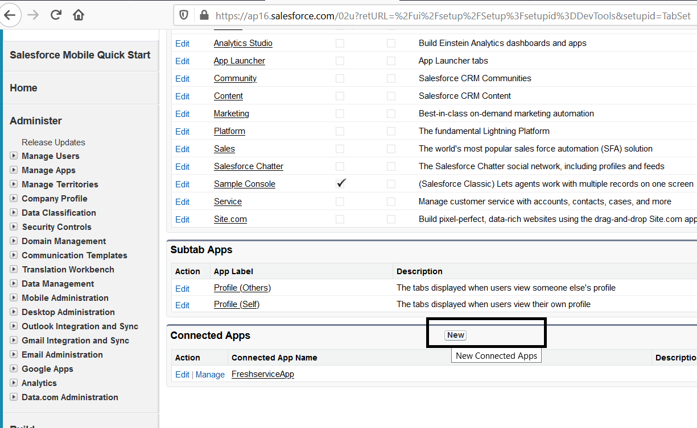 

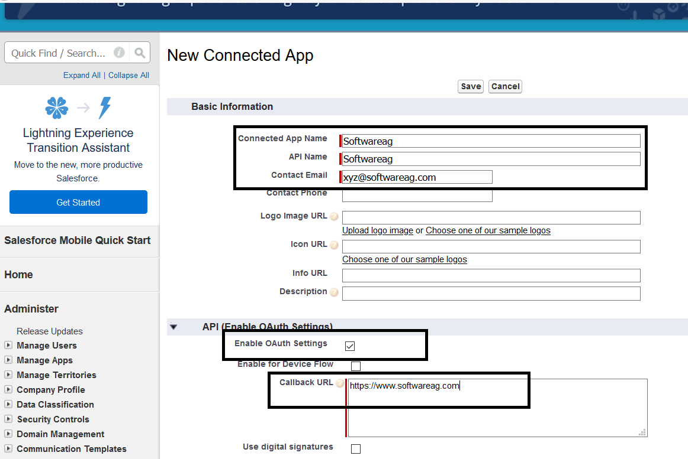 

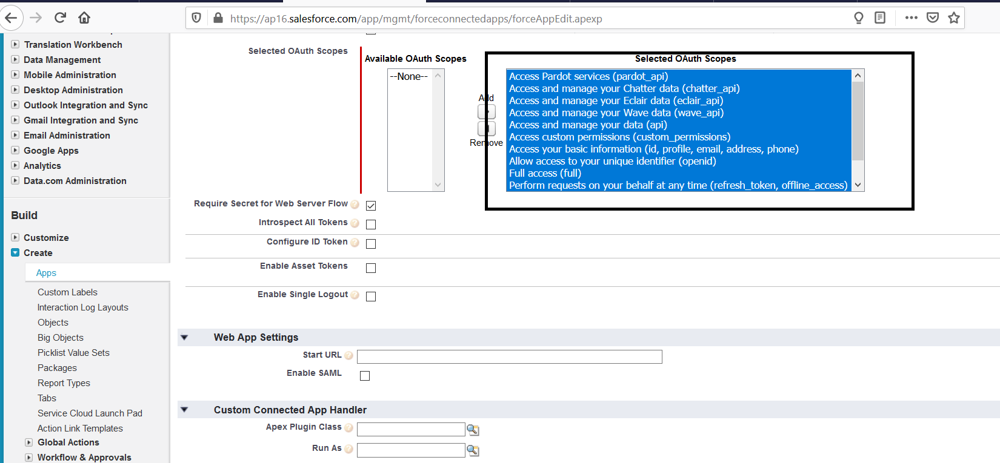 

 6. **Save** the application and click on **Next**. Allow the app for 10-20 mins for registration 
 7. Note the **Client Id**(Consumer Key) and **Client Secret**(Consumer Secret) generated 

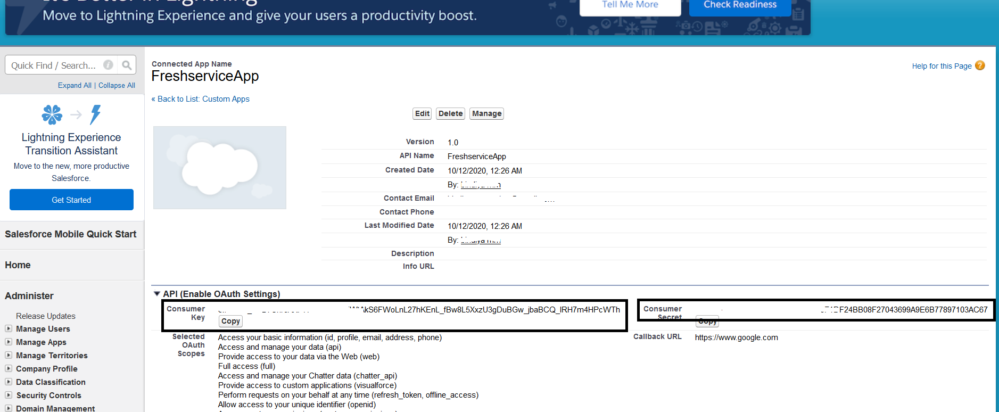 

 8. Get authorization code using the url below in browser and **allow** the browser to login to your salesforce account 
    **URL:** https://ap16.salesforce.com/services/oauth2/authorize?client_id=<client_id> &redirect_uri=https://www.softwareag.com& 
    response_type=code 
    
    *Note :- Instance can be found from login url. Example: ap15, ap16 etc.* 

 9. To get access token and refresh token use the below url in any REST client  
      *Note :- POSTMAN REST client is used here. Link to download [POSTMAN](https://www.postman.com/downloads/).* 
     
      Url     : https://ap16.salesforce.com/services/oauth2/token 
      Method  : POST 
      Params  : code, client_id, client_secret,redirect_uri and grant_type 
      Example : https://ap16.salesforce.com/services/oauth2/token?code=aPrx5xrKPFq2PGQVvFWARb6q3ZqTJaA%3D%3D&client_id=33AXP7P1Xg2UhM5WtAkS6FWoLnL27hKEnL_fBw8L5XxzU3gDuBGw_jbaBCQ_IRH7m4HPcWTh&client_secret=0FEA3069044194F115C8C2C24CD3F1DF24BB08F27043699A9AC67&redirect_uri=https://www.softwareag.com&grant_type=authorization_code 

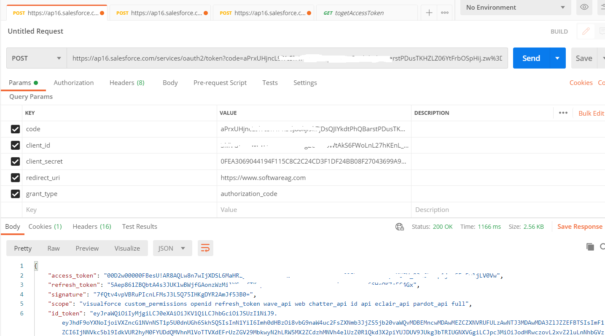 

 ### Section 2. Set up an account in webMethods.io

 **Steps** 

 10. Login to **webMethods.io** Integration tenant 
 11. Choose your project or click on **"+"** to create new project 

 

 12. Choose your workflow or click on **"+"** to create new workflow 

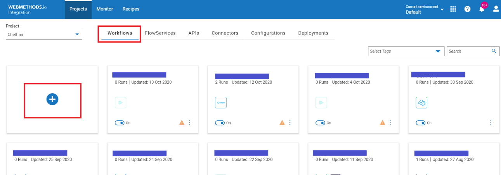 
 
 13. Name your workflow and then Drag and drop **Salesforce CRM** from the connector pallet and double click on 
     **Salesforce CRM**  connector to configure or hover over connector and click the settings icon 

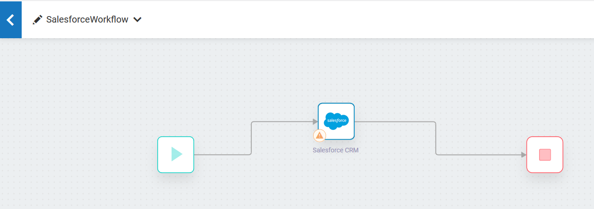 

 14. Select Action and for **Add Custom Action** option click on **"+"** add 

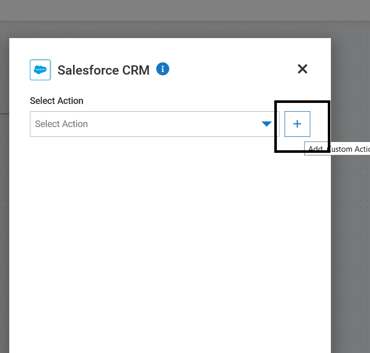 

 15. Choose existing account or to create new account click on **"+"** add button 

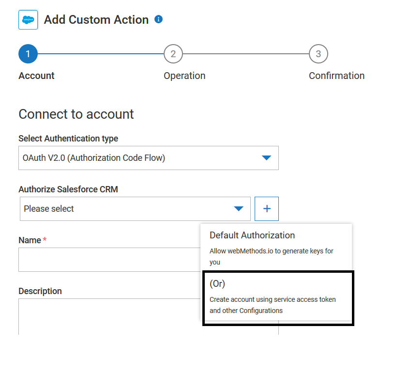 

 16. Fill in details like **Client Id**, **Client Secret**, **Access Token**, **Refresh Token** obtained in previous steps   
     (Step 7 & Step 9 respectively) and also Grant Type, Refresh URL, Server URL and Instance URL 
     
     *NOTE:- Server URL is different for SOAP and REST services. SOAP connector is used here.* 

      Server URL        : https://ap16.salesforce.com/services/Soap/u/44.0 {SOAP}  
      Server URL        : https://ap16.salesforce.com {REST}  
      Grant Type        : refresh_token  
      Refresh URL       : https://login.salesforce.com/services/oauth2/token  
      Instance URL      : https://ap16.salesforce.com  

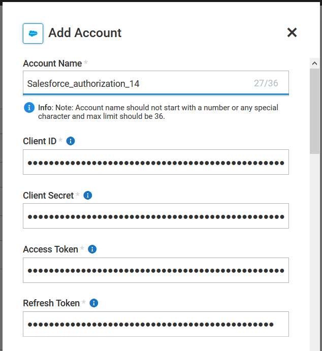  

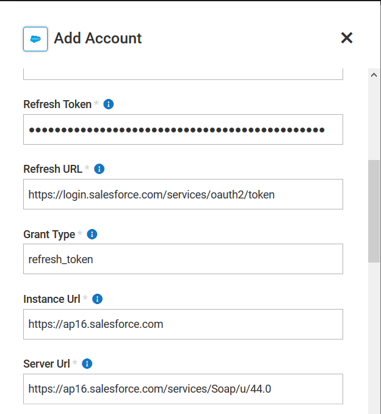  

17. Hit **Add** to save the connection  

