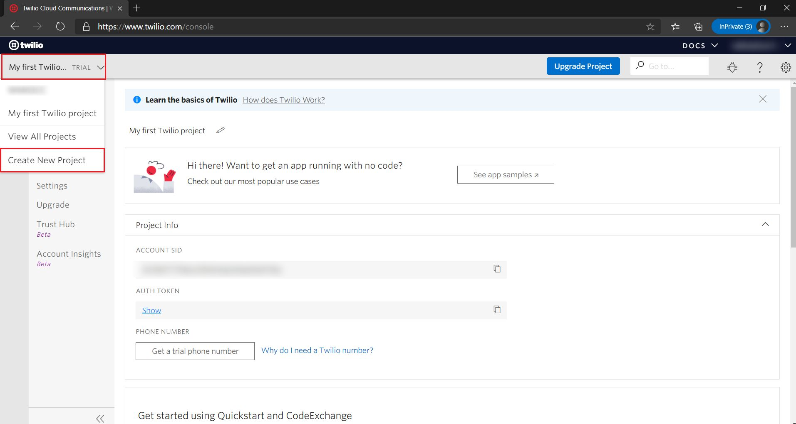
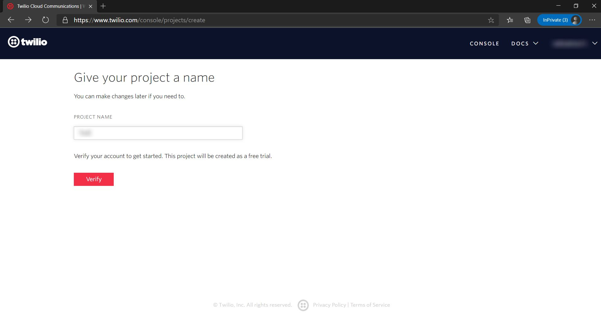
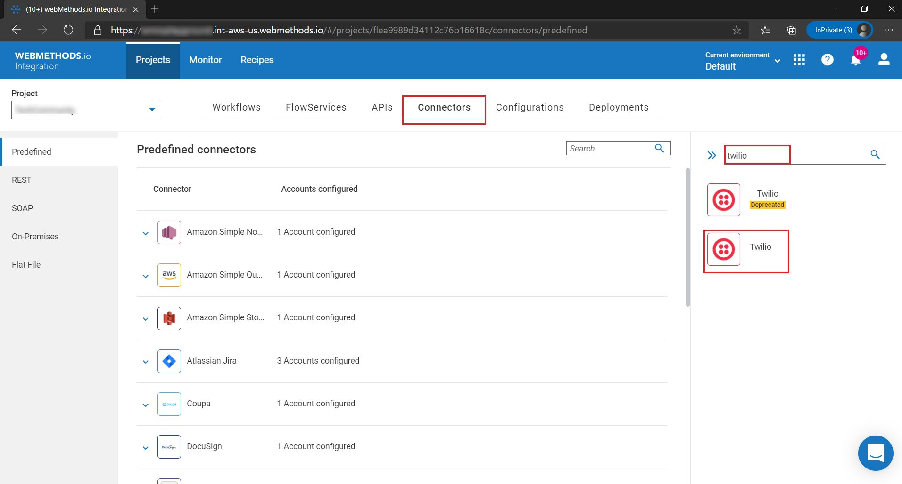
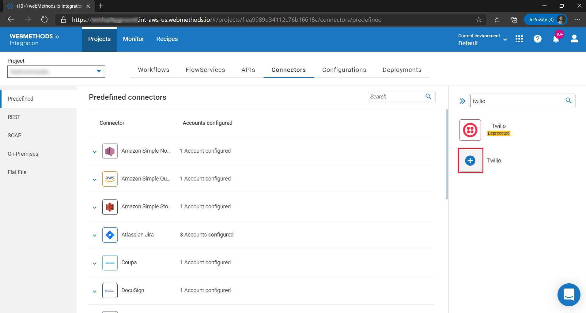
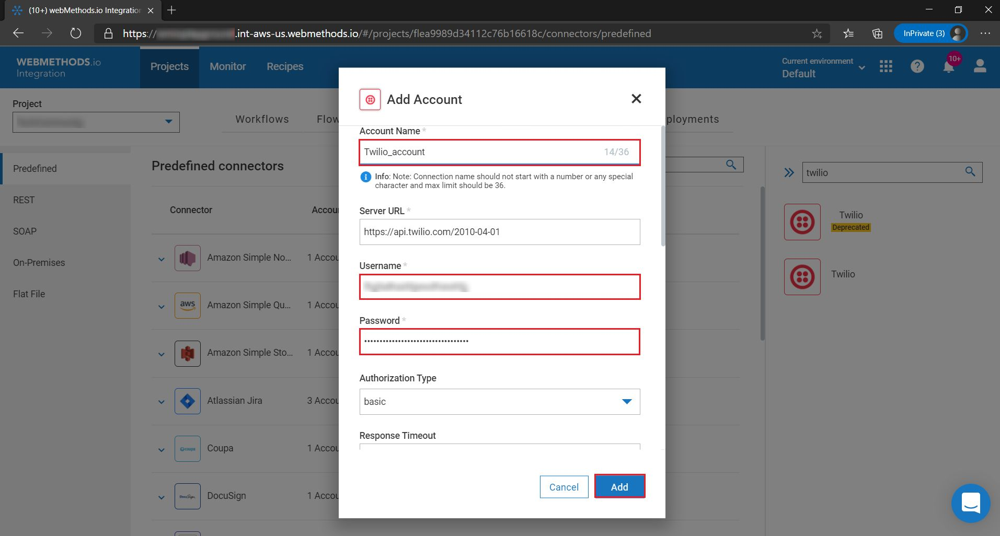

# Configuring Twilio account in webMethods.io Integration Workflow  

## Summary:

This article describes configuring an account to **Twilio** in **webMethods.io Workflow** 

## Pre-requisites:
•	Active **Twilio** account  
•	Active **webMethods.io Integration** tenant  

## Contents:

Section 1: Configure a **Twilio** account  
Section 2: Setting up a **Twilio** account in **webMethods.io Integration** tenant  

### Section 1. Configure a Twilio account  

1.  [Sign up](https://www.twilio.com/try-twilio) to Twilio or [login](https://www.twilio.com/login) if you already have an account. 

2. You can use the default project or create a new custom project. To create a project, click on the dropdown in the top left corner and select **Create New Project** option. 

	 

3.  Fill in required fields and verify your account to create the project. 

     
    
	 

4. Note down **Account SID**  and **Auth Token** 
	 

### Section 2: Setting up Loqate account in webMethods.io Integration Workflow 

5. Login to **webMethods.io Integration** tenant and choose your project or click on **"+"** to create new project 

6. Switch to **Connectors** tab 

7. Search for **Twilio** connector in the available connectors list.  

	 

8. Mouse hover on the **Loqate** connector icon and then click on the **"+"** icon. 

	 

9. Fill in the **Account name**, **Username**(Account SID) and **Password**(Auth token) obtained from Step 4 . Click on **Add**. 

	 

10. An account for **Twilio** connector has been added successfully, now you can use this account in your Workflows/Flowservices 
